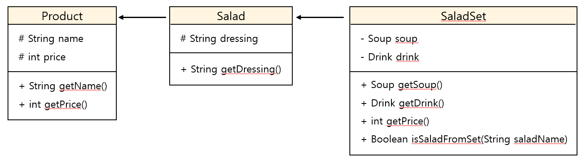

# 샐러드 메뉴 관리 시스템

## 프로젝트 개요
---
본 프로젝트는 CLI 기반의 콘솔 프로그램으로, 구매자가 구매할 수 있는 샐러드 메뉴 목록을 관리하는 시스템입니다. 사용자는 메뉴를 조회, 생성, 삭제할 수 있으며, 메뉴 항목들은 `샐러드`, `스프`, `음료`, `샐러드 세트`로 구성됩니다.

## 클래스 설명
---
### <상속 관계도>

- **Product**: 가장 최상위 클래스이며, 상품의 이름과 가격을 속성으로 가집니다.
- **Salad**: `Product`를 상속받아 `dressing`을 추가 속성으로 가집니다. `Salad`는 샐러드 메뉴를 나타내며, 샐러드와 드레싱은 하나의 메뉴로 고정된 형태입니다.
- **Soup**: `Product`를 상속받아 '스프' 상품을 나타냅니다.
- **Drink**: `Product`를 상속받아 '음료' 상품을 나타냅니다.
- **SaladSet**: `Salad`를 상속받아 '샐러드 세트' 메뉴를 나타냅니다. 세트 메뉴는 샐러드(드레싱) + 스프 + 음료로 구성되며, 가격은 각 상품의 가격의 총합입니다.
- **MenuManager**: 메인 메뉴를 관리하는 클래스입니다. 메뉴 항목을 추가하거나 삭제하는 등의 기능을 수행합니다.

## 주요 기능
---
1. **메뉴 조회**: 사용자는 샐러드와 샐러드 세트 메뉴를 조회할 수 있습니다.
2. **메뉴 생성**: 사용자는 새로운 샐러드 메뉴와 샐러드 세트 메뉴를 생성하여 메뉴 목록에 추가할 수 있습니다. 샐러드 세트 메뉴는 반드시 존재하는 샐러드, 스프, 음료로 구성되어야 합니다.
3. **메뉴 삭제**: 사용자는 기존의 샐러드와 샐러드 세트 메뉴를 삭제할 수 있습니다. 샐러드를 삭제하면 해당 샐러드가 포함된 샐러드 세트도 함께 삭제됩니다.

## 실행 시나리오
---

## 회고
---
이번 프로젝트를 통해 CLI 기반 프로그램에서 객체지향 설계를 구현하고, 상속 관계와 메뉴 관리 시스템을 어떻게 효율적으로 구성할 수 있을지에 대해 고민할 수 있었습니다. 각 상품의 상속관계를 설정하고 메뉴로 구성하는 게 리팩토링에 좋은 구조인지 앞으로의 확장 기능을 통해 수정해나가며 

---
