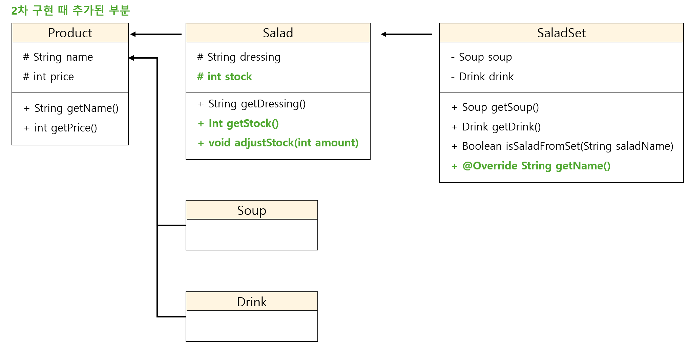

# 샐러드 메뉴 관리 시스템

## 프로젝트 개요
본 프로젝트는 CLI 기반의 콘솔 프로그램으로, 구매자가 구매할 수 있는 샐러드 메뉴 목록을 관리하는 시스템입니다. 사용자는 메뉴를 조회, 생성, 삭제할 수 있으며, 메뉴 항목들은 `샐러드`, `스프`, `음료`, `샐러드 세트`로 구성됩니다.

## 클래스 설명
### <상속 관계도>

- **Product**: 가장 최상위 클래스이며, 상품의 이름과 가격을 속성으로 가집니다.
- **Salad**: `Product`를 상속받아 `dressing`을 추가 속성으로 가집니다. `Salad`는 샐러드 메뉴를 나타내며, 샐러드와 드레싱은 하나의 메뉴로 고정된 형태입니다.
- **Soup**: `Product`를 상속받아 '스프' 상품을 나타냅니다.
- **Drink**: `Product`를 상속받아 '음료' 상품을 나타냅니다.
- **SaladSet**: `Salad`를 상속받아 '샐러드 세트' 메뉴를 나타냅니다. 세트 메뉴는 샐러드(드레싱) + 스프 + 음료로 구성되며, 가격은 각 상품의 가격의 총합입니다.
- **MenuManager**: 메인 메뉴를 관리하는 클래스입니다. 메뉴 항목을 추가하거나 삭제하는 등의 기능을 수행합니다.

## 주요 기능
1. **메뉴 조회**: 사용자는 샐러드와 샐러드 세트 메뉴를 조회할 수 있습니다.
2. **메뉴 생성**: 사용자는 새로운 샐러드 메뉴와 샐러드 세트 메뉴를 생성하여 메뉴 목록에 추가할 수 있습니다. 샐러드 세트 메뉴는 반드시 존재하는 샐러드, 스프, 음료로 구성되어야 합니다.
3. **메뉴 삭제**: 사용자는 기존의 샐러드와 샐러드 세트 메뉴를 삭제할 수 있습니다. 샐러드를 삭제하면 해당 샐러드가 포함된 샐러드 세트도 함께 삭제됩니다.

## 실행 시나리오
/*
================================
샐러드 메뉴 관리 시스템 실행 시나리오
================================

1. 메뉴 조회
----------------------------------
<샐러드 메뉴>
- 메뉴 없음 (또는 등록된 샐러드 리스트 출력)
----------------------------------
<샐러드 세트 메뉴>
- 메뉴 없음 (또는 등록된 샐러드 세트 리스트 출력)

2. 메뉴 생성
----------------------------------
생성하려는 메뉴를 선택하세요.
1. 샐러드
2. 샐러드 세트

// 샐러드 생성 시
샐러드명: 그린 샐러드
가격: 7500
드레싱: 시저
▶ '그린 샐러드(시저)'가 생성되었습니다.

// 샐러드 세트 생성 시
[샐러드 목록]
1. 그린 샐러드
샐러드 선택: 1
[스프 목록]
1. 양송이 스프
스프 선택: 1
[음료 목록]
1. 오렌지 주스
음료 선택: 1
▶ '그린 샐러드(시저) + 양송이 스프 + 오렌지 주스 세트 : 12500(원)'이 생성되었습니다.

3. 메뉴 삭제
----------------------------------
어떤 메뉴를 삭제하시겠습니까?
1. 샐러드
2. 샐러드 세트

// 샐러드 삭제 시
삭제할 샐러드를 선택하세요.
1. 그린 샐러드
샐러드 선택: 1
▶ '그린 샐러드'가 삭제되었습니다.

// 샐러드 세트 삭제 시
삭제할 샐러드 세트를 선택하세요.
1. 그린 샐러드 세트
샐러드 세트 선택: 1
▶ '그린 샐러드 세트'가 삭제되었습니다.

================================
*/

